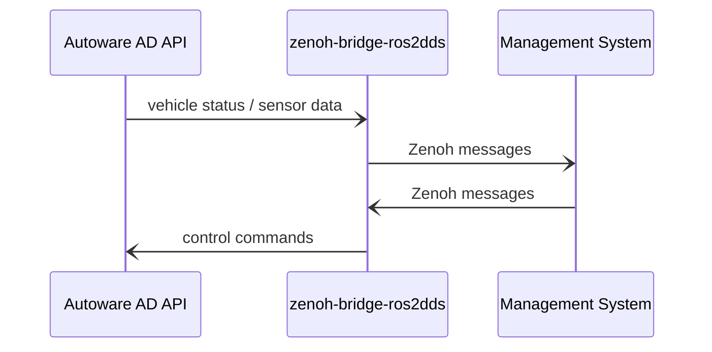

# zenoh_autoware_fms

The project is the FMS (fleet management system) prototype of Autoware based on Zenoh.




## Usage

### Basic test

- Install prerequisite

```shell
./prerequisite.sh
```

- Run Web Server & API Server

```shell
# Before the following steps, please source ROS 2 environment
source env.sh

# Run with rmw_zenoh (without zenoh-bridge-ros2dds)
just run_rmw_zenoh

# Or run with zenoh-bridge-ros2dds
just run_ros2dds
```

- You can use [the environment](https://github.com/evshary/zenoh_demo_docker_env/tree/main/autoware_fms_with_bridge_ros2dds) to test FMS
  - Remember to change the environment `FMS_CONNECTION`, which means FMS IP.

### Integration with Carla

Here is [the tutorial](https://autoware-carla-launch.readthedocs.io/en/latest/scenarios/fms.html) how to run FMS with Carla.

## Development

- API Server: [http://127.0.0.1:8000/docs](http://127.0.0.1:8000/docs)
- Zenoh Listen Port: TCP/7887

## Project

Please check our roadmap in [GitHub Project](https://github.com/users/evshary/projects/2)

## For Developers

You can use pre-commit and Ruff to have correct Python format

```shell
python3 -m pip install pre-commit ruff
pre-commit install --install-hooks
```

## Autoware Topics & Services in Use

Below is the list of topics and services currently in use in the FMS:

### Topic

| Category | Name                                    | Type                                                                 | Description                                | Note                                                              |
| :------- | :-------------------------------------- | :------------------------------------------------------------------- | :----------------------------------------- | :---------------------------------------------------------------- |
| Pose     | /api/vehicle/kinematics                 | autoware_adapi_v1_msgs/msg/VehicleKinematics                         | Retrieve vehicle kinematics                |                                                                   |
| Pose     | /api/routing/route                      | autoware_adapi_v1_msgs/msg/Route                                     | Retrieve the route and goal position       |                                                                   |
| Pose     | /control/gate_mode_cmd                  | tier4_control_msgs/msg/GateMode                                      | Set the gate mode to AUTO                  | To be replaced by /api/operation_mode/enable_autoware_control     |
| Status   | /api/external/get/cpu_usage             | tier4_autoware_msgs/tier4_external_api_msgs/msg/CpuUsage             | Retrieve current CPU usage statistics      |                                                                   |
| Status   | /api/external/get/vehicle/status        | tier4_autoware_msgs/tier4_external_api_msgs/msg/VehicleStatusStamped | Retrieve gear shift and turn signal status |                                                                   |
| Teleop   | /api/external/get/vehicle/status        | tier4_autoware_msgs/tier4_external_api_msgs/msg/VehicleStatusStamped | Retrieve gear shift and turn signal status |                                                                   |
| Teleop   | /control/gate_mode_cmd                  | tier4_control_msgs/msg/GateMode                                      | Set the gate mode to External              | To be replaced by /api/operation_mode/disable_autoware_control    |
| Teleop   | /api/external/set/command/remote/shift  | tier4_autoware_msgs/tier4_external_api_msgs/msg/GearShiftStamped     | Set gear shift from FMS                    |                                                                   |
| Teleop   | /external/selected/control_cmd          | autoware_control_msgs/msg/Control                                    | Set the target speed and steering angle    | AWS currently does not provide an API for setting speed           |
| Camera   | /sensing/camera/traffic_light/image_raw | sensor_msgs/msg/Image                                                | Retrieve camera image                      | AWS currently does not provide an API for streaming camera images |

### Service

| Category | Name                                     | Type                                           | Description                             |
| :------- | :--------------------------------------- | :--------------------------------------------- | :-------------------------------------- |
| Pose     | /api/operation_mode/change_to_autonomous | autoware_adapi_v1_msgs/srv/ChangeOperationMode | Change the operation mode to autonomous |
| Pose     | /api/routing/clear_route                 | autoware_adapi_v1_msgs/srv/ClearRoute          | Clear the currently set route           |
| Pose     | /api/routing/set_route_points            | autoware_adapi_v1_msgs/srv/SetRoutePoints      | Define the route goal and waypoints     |
| Teleop   | /api/operation_mode/change_to_remote     | autoware_adapi_v1_msgs/srv/ChangeOperationMode | Change the operation mode to remote     |
