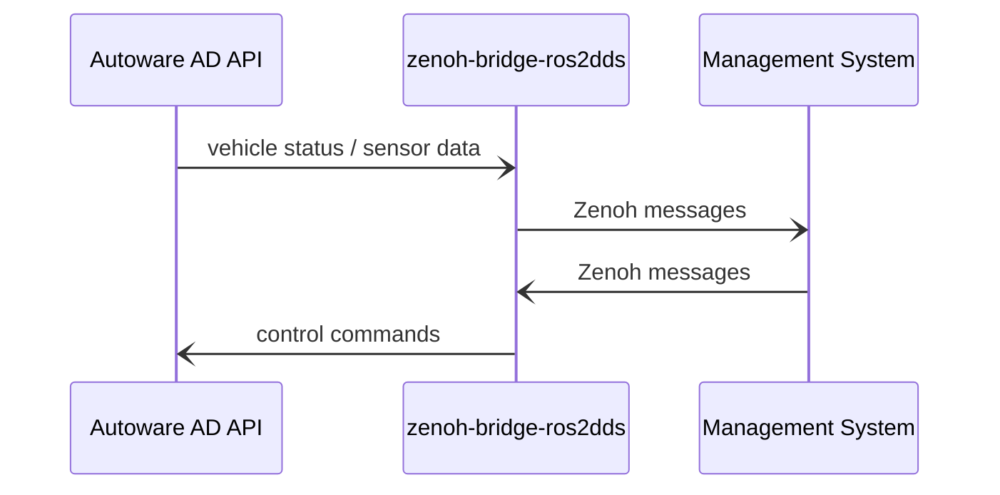

# zenoh_autoware_fms

The project is the FMS (fleet management system) prototype of Autoware based on Zenoh.



```mermaid
sequenceDiagram
Autoware AD API -) zenoh-bridge-ros2dds: vehicle status / sensor data
zenoh-bridge-ros2dds -) Management System: Zenoh messages
Management System -) zenoh-bridge-ros2dds: Zenoh messages
zenoh-bridge-ros2dds -) Autoware AD API: control commands
```

## Usage

### Basic test

The whole FMS dev stack — Carla simulator, ROS↔Zenoh bridge, Autoware, the FMS API, and the frontend — is driven by three `just` recipes. The backend defaults to Carla; override it with `BACKEND=<name>` (see [`backends/README.md`](backends/README.md)).

| Command | When to run | Effect |
| :------ | :---------- | :----- |
| `just setup` | Once, on a fresh checkout | Installs host prerequisites and builds everything the stack needs — Docker images, the Rust sim↔ROS bridge, the Autoware ROS workspace, the map and perception models (several GB, slow). Idempotent: re-running skips finished steps. |
| `just up` | Every session | Starts the full stack — simulator, bridge, Autoware, teleop node, FMS API + frontend — and waits until the API (`:8000`) and frontend (`:3000`) answer. Then open <http://localhost:3000> to drive. |
| `just down` | When finished | Stops everything `just up` started (FMS services, backend containers, simulator) and frees their ports. Deletes no files. |

```shell
just setup   # one-time setup (slow; downloads several GB)
just up      # start the stack, then open http://localhost:3000
just down    # stop the stack
```

Lower-level recipes, for when you run the backend yourself:

| Command | Effect |
| :------ | :----- |
| `just run_rmw_zenoh` | Run only the FMS API + frontend, talking to Autoware over `rmw_zenoh` (no `zenoh-bridge-ros2dds`). |
| `just run_ros2dds` | Run only the FMS API + frontend, over the `zenoh-bridge-ros2dds` path. |
| `just clean` | Delete Python build artifacts (`__pycache__`, `.venv`). Does **not** stop a running stack — use `just down` for that. |

- You can use [the environment](https://github.com/evshary/zenoh_demo_docker_env/tree/main/autoware_fms_with_bridge_ros2dds) to test FMS
  - Remember to change the environment `FMS_CONNECTION`, which means FMS IP.

### Integration with Carla

Here is [the tutorial](https://autoware-carla-launch.readthedocs.io/en/latest/scenarios/fms.html) how to run FMS with Carla.

## Development

- API Server: [http://127.0.0.1:8000/docs](http://127.0.0.1:8000/docs)
- Zenoh Listen Port: TCP/7887

## Project

Please check our roadmap in [GitHub Project](https://github.com/users/evshary/projects/2)

## For Developers

You can use pre-commit and Ruff to have correct Python format

```shell
uv run pre-commit install --install-hooks
```

## Autoware Topics & Services in Use

Below is the list of topics and services currently in use in the FMS:

### Topic

| Category | Name                                    | Type                                                                 | Description                                | Note                                                              |
| :------- | :-------------------------------------- | :------------------------------------------------------------------- | :----------------------------------------- | :---------------------------------------------------------------- |
| Pose     | /api/vehicle/kinematics                 | autoware_adapi_v1_msgs/msg/VehicleKinematics                         | Retrieve vehicle kinematics                |                                                                   |
| Pose     | /api/routing/route                      | autoware_adapi_v1_msgs/msg/Route                                     | Retrieve the route and goal position       |                                                                   |
| Pose     | /control/gate_mode_cmd                  | tier4_control_msgs/msg/GateMode                                      | Set the gate mode to AUTO                  | To be replaced by /api/operation_mode/enable_autoware_control     |
| Status   | /api/external/get/cpu_usage             | tier4_autoware_msgs/tier4_external_api_msgs/msg/CpuUsage             | Retrieve current CPU usage statistics      |                                                                   |
| Status   | /api/external/get/vehicle/status        | tier4_autoware_msgs/tier4_external_api_msgs/msg/VehicleStatusStamped | Retrieve gear shift and turn signal status |                                                                   |
| Teleop   | /api/external/get/vehicle/status        | tier4_autoware_msgs/tier4_external_api_msgs/msg/VehicleStatusStamped | Retrieve gear shift and turn signal status |                                                                   |
| Teleop   | /control/gate_mode_cmd                  | tier4_control_msgs/msg/GateMode                                      | Set the gate mode to External              | To be replaced by /api/operation_mode/disable_autoware_control    |
| Teleop   | /api/external/set/command/remote/shift  | tier4_autoware_msgs/tier4_external_api_msgs/msg/GearShiftStamped     | Set gear shift from FMS                    |                                                                   |
| Teleop   | /external/selected/control_cmd          | autoware_control_msgs/msg/Control                                    | Set the target speed and steering angle    | AWS currently does not provide an API for setting speed           |
| Camera   | /sensing/camera/traffic_light/image_raw | sensor_msgs/msg/Image                                                | Retrieve camera image                      | AWS currently does not provide an API for streaming camera images |

### Service

| Category | Name                                     | Type                                           | Description                             |
| :------- | :--------------------------------------- | :--------------------------------------------- | :-------------------------------------- |
| Pose     | /api/operation_mode/change_to_autonomous | autoware_adapi_v1_msgs/srv/ChangeOperationMode | Change the operation mode to autonomous |
| Pose     | /api/routing/clear_route                 | autoware_adapi_v1_msgs/srv/ClearRoute          | Clear the currently set route           |
| Pose     | /api/routing/set_route_points            | autoware_adapi_v1_msgs/srv/SetRoutePoints      | Define the route goal and waypoints     |
| Teleop   | /api/operation_mode/change_to_remote     | autoware_adapi_v1_msgs/srv/ChangeOperationMode | Change the operation mode to remote     |
