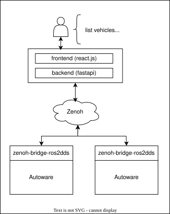
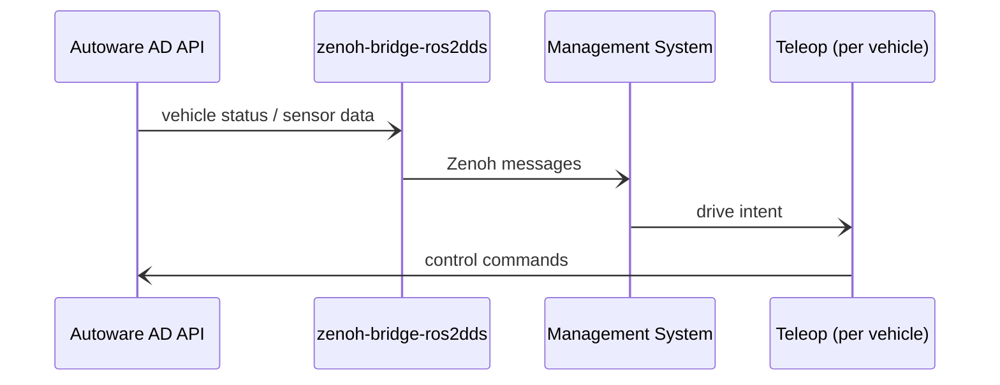

# zenoh_autoware_fms

The project is the FMS (fleet management system) prototype of Autoware based on Zenoh.




```mermaid
sequenceDiagram
Autoware AD API -) zenoh-bridge-ros2dds: vehicle status / sensor data
zenoh-bridge-ros2dds -) Management System: Zenoh messages
Management System -) Teleop (per vehicle): drive intent
Teleop (per vehicle) -) Autoware AD API: control commands
```

## Prerequisites

FMS orchestrates a full simulation stack. The host needs:

- **An NVIDIA GPU with a working driver.** `just up vehicle` dies if no GPU passthrough works; a GPU-less host still brings the frontend up. The Autoware container reaches the GPU via `docker --gpus`, CDI, or direct `/dev/nvidia*` binds; any one is enough.
- **Host tools:** `docker`, `git`, `uv`, `node`, `npm`, `just`, `colcon`, `curl`. `just setup` checks this list and bails if any is missing.
- **apt packages** (installed by `prerequisite.sh` via `sudo`): `build-essential`, `cmake`, `libyaml-dev`, `nlohmann-json3-dev`, and GNU `parallel`.
- **Disk / network:** the default Carla backend needs ~14 GB of build artifacts + 2 Docker images, plus ~7 GB for the Carla binary if auto-downloaded (`CARLA_AUTODOWNLOAD=1`); ~6 GB of image/model pulls over the network. See [`backends/carla.md`](backends/carla.md) for the full backend breakdown.

## Usage

### Quick start

Carla simulator, sim↔ROS bridge, Autoware, FMS API, and the frontend. The backend defaults to Carla; override it with `BACKEND=<name>` (see [`backends/README.md`](backends/README.md)):

```shell
just setup             # one-time setup (slow; downloads several GB)
just up fms            # shared infra, then open http://localhost:3000
just up vehicle v1     # add a vehicle (scope: letter then [A-Za-z0-9_]; repeat for more)
just down              # stop the stack
```

`just up fms` starts the shared infra (simulator + world + bridge + FMS API + frontend). `just up vehicle <scope>` brings up one vehicle's ego + Autoware; the per-vehicle teleop is **not** started here — it attaches later from the UI when you select the vehicle to drive.

`just setup` is idempotent (re-runs skip completed steps); `just clean` removes Python build artifacts (`__pycache__`, `.venv`) without stopping a running stack.

### Drive

1. Open **http://localhost:3000** and go to **Remote Driving** in the sidebar.
2. Pick your vehicle's scope (e.g. `v1`) in **Vehicle Selection** and click **Teleop** — this attaches the per-vehicle teleop.
3. With the drive view focused, use the on-screen keys (or the keyboard):

   | Key | Action |
   | :-- | :----- |
   | `W` `A` `S` `D` | gas / left / brake / right (hold) |
   | `Z` | Toggle STOP ↔ drive (self-engages Autoware control) |
   | `X` / `C` / `V` | Drive / Reverse / Park |
   | `M` | Cycle drive mode |
   | `R` | Reset (re-seed) initial pose |

   Typical start: `Z` to engage, `M` to leave the braking `stop` mode, `X` for Drive, then hold `W` to move. The full teleop key legend and drive modes are in [`external/autoware_manual_control/README.md`](external/autoware_manual_control/README.md).

The **Map View** tab shows each vehicle's pose/route on the lanelet map.

### Multiple vehicles

Repeat `just up vehicle <scope>` with a fresh scope for each vehicle (`v2`, `v3`, …); each gets its own ego + Autoware and appears in the UI vehicle list. A scope must be a token: a letter followed by `[A-Za-z0-9_]*` (it becomes a container name, a Zenoh key, and a ROS namespace).

https://github.com/user-attachments/assets/c60e629d-6b95-4899-a673-c82a51f002b6

Tear down one vehicle with `just down vehicle <scope>` (the rest stay up); `just down` stops everything.

### Single vehicle over ROS (`--ros`)

`just up --ros` brings up one vehicle driven the ROS way: sim + bridge + Autoware + an in-container `zenoh_control` teleop over DDS, no fleet and no scope. Use this to exercise the single-vehicle path; multi-vehicle stays Zenoh-only.

### Ports and side effects

The stack owns these host ports (default Carla backend). `just up fms` frees its own ports first: it **kills whatever holds :2000, :8000 and :3000** from a previous run and restarts Carla deterministically (`CARLA_REUSE=1` keeps a known-healthy Carla instead):

| Port | Owner | Started by |
| :--- | :---- | :--------- |
| 2000 | Carla RPC | `up fms` |
| 7447 | sim↔ROS bridge (Zenoh listen) | `up fms` |
| 7887 | FMS API (Zenoh listen) | `up fms` |
| 8000 | FMS API (HTTP) | `up fms` |
| 3000 | frontend | `up fms` |
| 7448+N | vehicle's ros2dds bridge, N = its `ROS_DOMAIN_ID` | each `up vehicle` (first vehicle: 7449) |

- `up vehicle` needs a running `up fms` (Carla, world, sim bridge) plus GPU passthrough. Autoware containers are host-networked, so vehicles share the host's DDS space — isolated by a per-vehicle `ROS_DOMAIN_ID` allocated from 1 (the ambient domain 0 is left alone).
- `just down` removes all stack containers, kills Carla (kept if `CARLA_REUSE=1`), frees :8000/:3000, and kills **every host process named exactly `zenoh_control`** — including any you started by hand. Generated state stays in `tmp/` (per-scope configs and logs, `vehicle_domains.env`) and `logs/`; it is reused or regenerated on the next `up`.
- `just down vehicle <scope>` detaches that vehicle's teleop through the API (process-kill fallback if the API is down), removes only its containers, and drops its line from `tmp/vehicle_domains.env`; the rest of the stack stays up.
- The Zenoh planes must stay clean: one wedged client on :7887/:7447+ stalls routing — `just doctor` names the strays (it also runs as the last `up fms` step).

### Run just the FMS layer

If you've already brought up Carla + the sim↔ROS bridge + Autoware yourself (e.g. via [autoware_carla_launch](https://autoware-carla-launch.readthedocs.io/en/latest/scenarios/fms.html) by hand, or on real hardware), install host prereqs once and launch just the FMS layer (API + frontend) over your existing transport:

```shell
./prerequisite.sh
just run
```

- You can also use [this docker env](https://github.com/evshary/zenoh_demo_docker_env/tree/main/autoware_fms_with_bridge_ros2dds) to test FMS — set `FMS_CONNECTION` to the FMS host IP.

### Integration with Carla

Here is [the tutorial](https://autoware-carla-launch.readthedocs.io/en/latest/scenarios/fms.html) how to run FMS with Carla.

### Troubleshooting

- **A GPU / passthrough error on `just up vehicle`** — the Autoware bringup needs a working NVIDIA driver plus one of `docker --gpus`, CDI, or `/dev/nvidia*`; see [Prerequisites](#prerequisites).
- **Nothing drives / no ego spawns / engage never confirms** — Carla often degrades after a long run (RPC timeouts, stale actors). Re-run `just up fms` for a clean, deterministic Carla restart.
- **Stalled/stray Zenoh clients** — `just doctor` flags host processes on the Zenoh planes; one wedged subscriber stalls routing for everyone. Kill the strays it reports.
- **Backend-specific issues** (missing Carla binary, Docker images, map, port 2000 timeouts) — see [`backends/carla.md`](backends/carla.md).

## Development

- API Server: [http://127.0.0.1:8000/docs](http://127.0.0.1:8000/docs)
- Zenoh Listen Port: TCP/7887

## Project

Please check our roadmap in [GitHub Project](https://github.com/users/evshary/projects/2)

## For Developers

You can use pre-commit and Ruff to have correct Python format

```shell
uv run pre-commit install --install-hooks
```

## Autoware Topics & Services in Use

Below is the list of topics and services in use, by the FMS server ("FMS" rows) and by the per-vehicle teleop it spawns ("Teleop" rows). On Zenoh every name is prefixed with the vehicle's scope by its bridge (`<scope>/...`):

### Topic

| Used by | Name                                     | Type                                                     | Description                                          |
| :------ | :--------------------------------------- | :------------------------------------------------------- | :--------------------------------------------------- |
| FMS     | /api/localization/initialization_state   | autoware_adapi_v1_msgs/msg/LocalizationInitializationState | Latched at vehicle bringup; presence for the vehicle list |
| FMS     | /api/vehicle/kinematics                  | autoware_adapi_v1_msgs/msg/VehicleKinematics             | Vehicle pose for the Map View                        |
| FMS     | /api/routing/route                       | autoware_adapi_v1_msgs/msg/Route                         | Route and goal for the Map View                      |
| FMS     | /api/external/get/cpu_usage              | tier4_external_api_msgs/msg/CpuUsage                     | CPU usage statistics                                 |
| FMS     | /sensing/camera/traffic_light/image_raw  | sensor_msgs/msg/Image                                    | Camera stream for the `/video` WebSocket             |
| Teleop  | /vehicle/status/velocity_status          | autoware_vehicle_msgs/msg/VelocityReport                 | Speed, reported back as telemetry                    |
| Teleop  | /vehicle/status/gear_status              | autoware_vehicle_msgs/msg/GearReport                     | Gear confirmation                                    |
| Teleop  | /vehicle/status/steering_status          | autoware_vehicle_msgs/msg/SteeringReport                 | Steering angle                                       |
| Teleop  | /api/operation_mode/state                | autoware_adapi_v1_msgs/msg/OperationModeState            | Operation-mode / engage confirmation                 |
| Teleop  | /external/selected/control_cmd           | autoware_control_msgs/msg/Control                        | Target speed and steering angle                      |
| Teleop  | /external/selected/gear_cmd              | autoware_vehicle_msgs/msg/GearCommand                    | Gear shift                                           |
| Teleop  | /external/local/heartbeat, /external/remote/heartbeat | autoware_adapi_v1_msgs/msg/ManualOperatorHeartbeat | Keeps the operator mode available            |
| Teleop  | /initialpose                             | geometry_msgs/msg/PoseWithCovarianceStamped              | Re-seed localization from a configured preset        |

### Service

| Used by | Name                                            | Type                                           | Description                                  |
| :------ | :----------------------------------------------- | :---------------------------------------------- | :-------------------------------------------- |
| Teleop  | /api/operation_mode/change_to_remote, change_to_local | autoware_adapi_v1_msgs/srv/ChangeOperationMode | Enter the operator's drive mode          |
| Teleop  | /api/operation_mode/change_to_stop              | autoware_adapi_v1_msgs/srv/ChangeOperationMode | STOP toggle                                  |
| Teleop  | /api/operation_mode/enable_autoware_control     | autoware_adapi_v1_msgs/srv/ChangeOperationMode | Self-engage after a mode change              |
